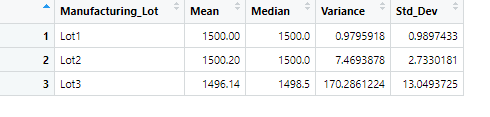
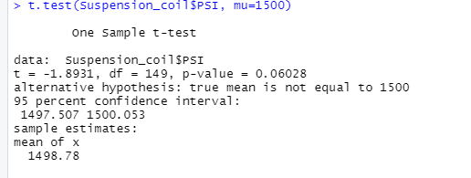
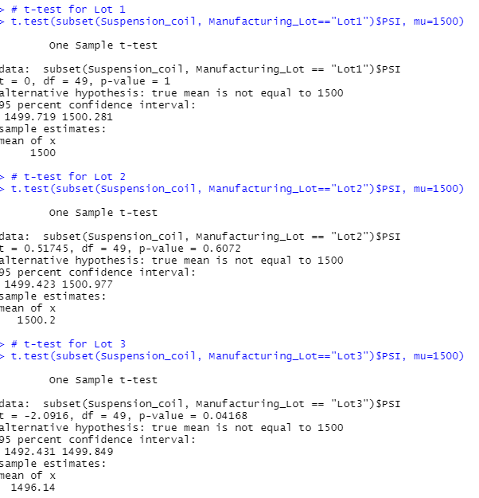

# Mechacar_Statistical_Analysis
## Linear Regression to Predict MPG

- Q1: Which variables/coefficients provided a non-random amount of variance to the mpg values in the dataset?  
A1: According to our linear regression model, vehicle length and ground clearance provide a non-random amount of variance to the mpg values.
- Q2: Is the slope of the linear model considered to be zero? Why or why not?  
A2: No, because a slope of zero would indicate that our model does not explain the variability in mpg across the relevant factors; that is, a slope of zero would mean that the observed variability in mpg values is random, which it is not.

- Q3: Does this linear model predict mpg of MechaCar prototypes effectively? Why or why not?  
A3: Yes. The r-squared value of this regression is .71, indicating that our model is effective in predicting the mpg of MechaCar prototypes.  
## Summary Statistics on Suspension Coils
Q: The design specifications for the MechaCar suspension coils dictate that the variance of the suspension coils must not exceed 100 pounds per square inch. Does the current manufacturing data meet this design specification for all manufacturing lots in total and each lot individually? Why or why not?  
A: The current manufacturing data for all lots does meet the design specifications:  
  
However, lot 3 individually does not meet the design specifications:  
  
## T-Tests on Suspension Coils
Our T-test for all lots returned a p-value of .06. As this is greater than the significance level of .05, we do not reject the null hyptothesis and conclude that the PSI for all lots is not statistically different from the population mean of 1500.  
  
However, for lot 3, we must reject the null hypothesis because our p-value (.04) is less than our significance level (.05). Consequently, we conclude that the PSI of lot 3 is statistically different from the population mean.  
  
## Study Design: MechaCar vs Competition  
A statistical study of potential interest would compare the fuel efficiency of the Mechacar to that of its competitors. 

- Null Hyptothesis (H0): There is no statistical difference between the fuel efficiencies of the MechaCar and competing models.
- Alternative Hypothesis (HA): There is a statistical difference in fuel efficiencies.  

To perform this study, we would need to collect data on city and highway mpg for the MechaCar. Additionally, we would need to gather the same metrics from a representative sample from among competing manufacturers. 

Next, we must decide on a significance level and perform the appropriate statistical test. Since we are comparing two different samples, we would need to use a two-sample T-test.
