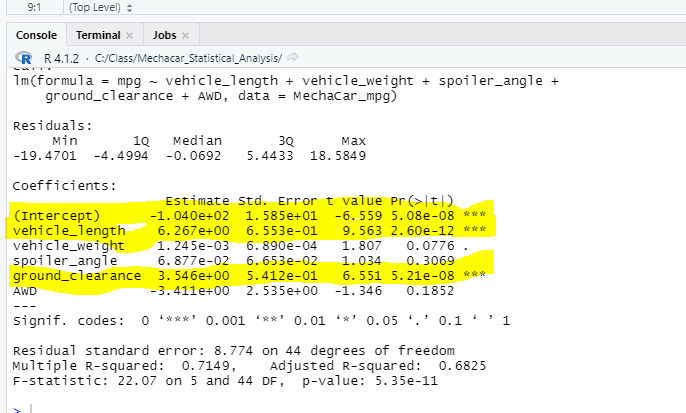

# Mechacar_Statistical_Analysis
## Linear Regression to Predict MPG

- Q1: Which variables/coefficients provided a non-random amount of variance to the mpg values in the dataset?  
A1: According to our linear regression model, vehicle length and ground clearance provide a non-random amount of variance to the mpg values.
- Q2: Is the slope of the linear model considered to be zero? Why or why not?  
A2: No, because a slope of zero would indicate that our model does not explain the variability in mpg across the relevant factors; that is, a slope of zero would mean that the observed variability in mpg values is random, which it is not.

- Q3: Does this linear model predict mpg of MechaCar prototypes effectively? Why or why not?  
A3: Yes. The r-squared value of this regression is .71, indicating that our model is effective in predicting the mpg of MechaCar prototypes.
